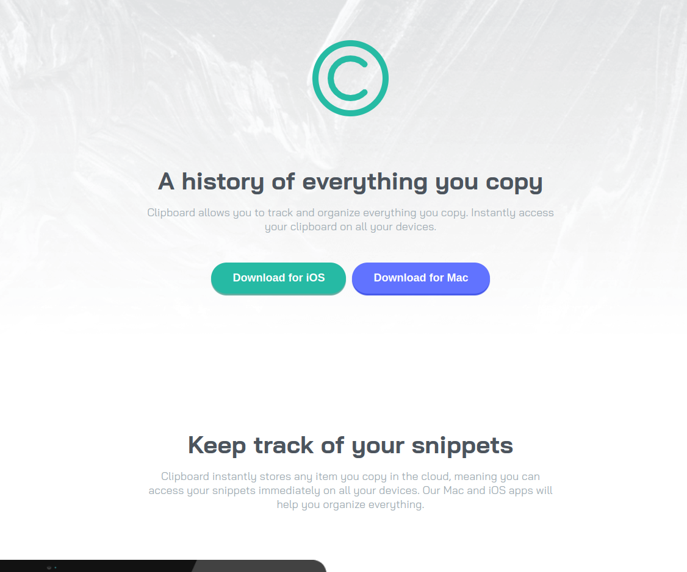

# Frontend Mentor - Clipboard landing page solution

This is a solution to the [Clipboard landing page challenge on Frontend Mentor](https://www.frontendmentor.io/challenges/clipboard-landing-page-5cc9bccd6c4c91111378ecb9). Frontend Mentor challenges help you improve your coding skills by building realistic projects.

## Table of contents

- [Overview](#overview)
  - [The challenge](#the-challenge)
  - [Screenshot](#screenshot)
  - [Links](#links)
- [My process](#my-process)
  - [Built with](#built-with)
  - [What I learned](#what-i-learned)
  - [Continued development](#continued-development)
- [Author](#author)

## Overview

### The challenge

Users should be able to:

- View the optimal layout for the site depending on their device's screen size
- See hover states for all interactive elements on the page

### Screenshot

### Links

- Solution URL: [Solution](https://www.frontendmentor.io/solutions/semiresponsive-landing-page-with-flexbox-fFsiBqpDvb)
- Live Site URL: [Live Site](https://fm-clipboard-page.netlify.app/)

## My process

### Built with

- Semantic HTML5 markup
- CSS custom properties
- Flexbox

### What I learned

I learned quite alot from this one project, so here's a recap of I've learned:

- Transitions
- Background Images
- Media queries

### Continued development

In the future, I will try to make the footer more responsive and also turn this into a React App.

## Author

- Website - [Leanghok](https://github.com/leanghok120)
- Frontend Mentor - [@leanghok120](https://www.frontendmentor.io/profile/leanghok120)
